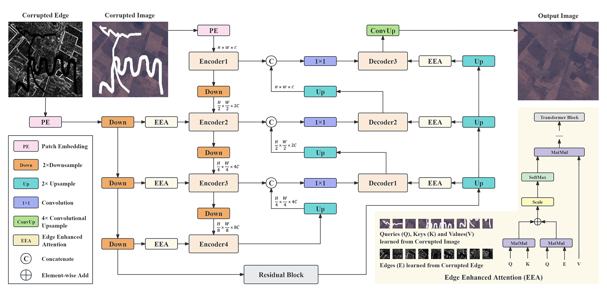

# Satellite Image Inpainting with Edge Enhanced Attention
This repository contains the implementation of the research paper "Satellite Image Inpainting with Edge Enhanced Attention". The paper is currently under submission.

## Introduction
Satellite image inpainting is an important task in remote sensing and image processing. This project implements a novel inpainting method that leverages edge-enhanced attention mechanisms base on a pure Transformer architecture to improve the quality and accuracy of inpainted satellite images.

## Requirements
Python >=3.6

PyTorch >=1.6

NVIDIA GPU + CUDA cuDNN

## Installation
1. Clone the repository:
   
   ```git clone https://github.com/Chowdz/EEA.git```

   ```cd EEA```
  
2. Install dependencies:
   
   ```pip install -r requirements.txt```

## Pipeline

  
## Dataset

We utilized [Google Earth Engine (GEE) API](https://doi.org/10.1016/j.rse.2017.06.031) to obtain a dataset of satellite images collected before May 31, 2003. Each image has dimensions of 8131×7061 pixels, a spatial resolution of 30 meters, and consists of 8 bands. The dataset was curated to include satellite images with cloud coverage below 1%. Our experiments focused specifically on bands B1, B2, and B3. Each satellite image was segmented into 400 images of size 256×256 pixels, covering an area of approximately 59 $km^2$ each. To test the capability of our model to address more complex losses beyond scanline corruption in satellite images, we utilized a manually drawn mask dataset [Quick Draw Irregular Mask Dataset](https://github.com/karfly/qd-imd).

## Training

1. Start:

   ```python trainer.py --batch_size 10 --epoch 5 --n_epoch 2000 --lr 0.0005 --beta1 0.95 --beta2 0.9995 --train_img_root 'data/train' --train_mask_root 'data/mask' --train_result_root 'data/result/' --save_model_root 'models/' --img_size 256 --in_c 4 --out_c 3 --patch_size 4 --embed_dim 64 --depth [1, 2, 3, 4] --num_heads [1, 2, 4, 8] --adv_loss_weight 0.8 --per_loss_weight 0.3 --sty_loss_weight 15000.0 --l1_loss_weight 50.0 --sobel_loss_weight 100.0 --sample_interval 500```

2. Tensorboard:
   
   ```tensorboard --logdir=logs```

## Result


## License
This project is licensed under the MIT License - see the [LICENSE](LICENSE) file for details.

## Contact
Feel free to contact us via email [dazhizhou18@gmail.com](dazhizhou18@gmail.com) or GitHub Issues for questions, feedback, or contributions to this project. We appreciate your interest!


